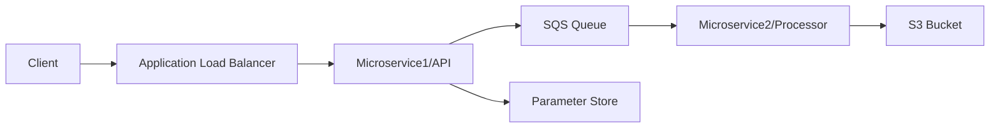

# Microservices Project


A distributed email processing system built with Python microservices and AWS infrastructure lavraging ECS. The system provides a secure API for email data ingestion and reliable background processing for S3 storage. both microservices resides in a private subnet with no public ip.

## Table of Contents
- [Overview](#overview)
- [System Architecture](#system-architecture)
- [Project Structure](#project-structure)
- [API Documentation](#api-documentation)
- [Configuration](#configuration)
- [Setup and Installation](#setup-and-installation)
- [Message Processing Flow](#message-processing-flow)
- [Security](#security)
- [Monitoring and Troubleshooting](#monitoring-and-troubleshooting)
- [Development Guidelines](#development-guidelines)

## Overview

This project implements a scalable email processing system using microservices architecture:
- **Microservice1**: REST API service that receives and validates email requests
- **Microservice2**: Background processor that stores validated email data in S3
- **Infrastructure**: Managed through Terraform on AWS

## System Architecture

### Components


### AWS Services
- **ECS**: Container orchestration for both microservices
- **ALB**: Load balancer for API traffic distribution
- **SQS**: Message queue ("devops-queue") with 30s visibility timeout
- **S3**: Storage bucket ("devops-assn-bucket-eranzaksh")
- **SSM**: Parameter Store for token management
- **ECR**: Container registry for service images
- **VPC**: Network isolation with public/private subnets

### Infrastructure State
- Remote state in S3: "microservices-terraform-state-bucket"
- Terraform version requirement: >= 1.2

## Project Structure

```
.
├── microservice1/                 # Email Ingestion Service
│   ├── app.py                     # Flask API (Port 8000)
│   ├── Dockerfile                 # Container configuration
│   └── requirements.txt           # Dependencies: flask, boto3, python-dotenv
├── microservice2/                 # Email Processing Service
│   ├── app.py                     # SQS consumer (10 messages batch, 10s polling)
│   ├── Dockerfile                 # Container configuration
│   ├── entrypoint.sh             # Container startup script
│   └── requirements.txt           # Dependencies: boto3, python-dotenv
├── terraform/
│   ├── modules/
│   │   └── vpc/                  # Network configuration
│   ├── main.tf                   # Core infrastructure setup
│   ├── ecr.tf                    # Create ECS cluster
│   └── [other .tf files]         # Additional infrastructure components
└── .github/                      # CI/CD configurations
```

## Configuration

### Environment Variables

| Variable | Description | Service |
|----------|-------------|----------|
| AWS_REGION | AWS region  | Both |
| TOKEN_PARAM_NAME | SSM parameter for auth token | Microservice1 |
| SQS_QUEUE_URL | URL for devops-queue | Both |
| S3_BUCKET_NAME | devops-assn-bucket-eranzaksh | Microservice2 |

### Infrastructure Variables
Required variables in `terraform/variables.tf`:
- `aws_region`: AWS deployment region
- `public_subnet_cidrs`: CIDR blocks for public subnets
- `private_subnet_cidrs`: CIDR blocks for private subnets

## Setup and Installation

### Prerequisites
- AWS CLI
- Terraform >= 1.2
- Python 3.x
- Docker


### Infrastructure Deployment
```bash
cd terraform
terraform init
terraform plan
terraform apply
```

## Message Processing Flow

1. Client sends authenticated POST request to /send-email
2. Microservice1:
   - Validates authentication token against SSM
   - Validates email timestamp
   - Sends valid messages to SQS queue
3. Microservice2:
   - Polls SQS queue (2 messages batch, 5s timeout)
   - Processes messages and stores in S3
   - Generates UUID-based filenames for storage
   - Deletes processed messages from queue

## Security

- **Authentication**: Token-based API authentication via SSM
- **Network Security**: 
  - VPC with private subnet isolation
  - Security groups for service access control, only the ALB sg is allowed to access microservice1.
- **Message Security**:
  - SQS queue with 30s visibility timeout
  - Message deletion post-processing
- **Data Security**:
  - S3 bucket security policies
  - IAM roles with least privilege
- **Secret Management**:
  - SSM Parameter Store for sensitive data
  - Environment variable protection


## CI/CD Pipeline

### GitHub Actions Workflow

The project uses GitHub Actions for continuous integration and deployment. The pipeline includes:

1. **Build & Test**
   - Lint Python code
   - Run unit tests
   - Build Docker images
   - Push to Docker Hub

2. **Infrastructure**
   - Terraform validation
   - Infrastructure deployment
   - AWS resource provisioning

3. **Deploy**
   - Deploy microservices to ECS
   - Health check verification
   - Infrastructure validation

### Required GitHub Secrets

Configure the following secrets in your GitHub repository (Settings > Secrets and variables > Actions):

| Secret Name | Description |
|------------|-------------|
| AWS_ACCESS_KEY_ID | AWS access key for authentication |
| AWS_SECRET_ACCESS_KEY | AWS secret key for authentication |
| AWS_REGION | AWS region (e.g., eu-north-1) |
| DOCKERHUB_USERNAME | Docker Hub username for image push |
| DOCKERHUB_TOKEN | Docker Hub access token |
| S3_BUCKET_NAME | S3 bucket for email storage |
| SQS_QUEUE_URL | SQS queue URL for message processing |
| TOKEN_PARAM_NAME | SSM parameter name for API token |

## Repository Replication Guide

Follow these steps to replicate this environment:

1. **Fork the Repository**
   ```bash
   # Clone your forked repository
   git clone https://github.com/YOUR_USERNAME/microservicesProject.git
   cd microservicesProject
   ```

2. **AWS Prerequisites**
   ```bash
   # Create S3 bucket for Terraform state
   aws s3 mb s3://microservices-terraform-state-bucket --region eu-north-1

   # Create SSM parameter for API token
   aws ssm put-parameter \
       --name "your-token-param-name" \
       --value "your-secure-token" \
       --type SecureString \
       --region eu-north-1
   ```

3. **Infrastructure Deployment**
   ```bash
   # Add your-token-param-name to tfvars (variable name: token_param_name) then Initialize and apply Terraform configuration. 
   # The output will give you SQS url for github secrets and ALB dns for POST.
   cd terraform
   terraform init
   terraform plan
   terraform apply
   ```

4. **Configure GitHub Secrets**
   - Go to your repository's Settings > Secrets and variables > Actions
   - Add all required secrets listed above
   - Ensure AWS credentials have necessary permissions

5. **Docker Hub Setup**
   - Create Docker Hub account if needed
   - Generate access token: Account Settings > Security > New Access Token
   - Add token to GitHub secrets

6. **Push code for microservice 1 and 2 to github**
   ```bash
   # CI/CD pipeline for each microservice will start running, then wait few minutes for the containers to be updated.
   ```

7. **Test the environment**

   ```bash
   curl -X POST \
     -H "Content-Type: application/json" \
     -d '{
           "data": {
             "email_subject":  "Test",
             "email_timestream":"1746192966",
             "email_sender":   "Eran Zaksh",
             "email_content":  "Testing email validity microservice"
           },
           "token": "your-token"
         }' \
     http://your-ALB-dns/send-email
  ```
   

### Common Issues and Troubleshooting

1. **GitHub Actions Failures**
   - Verify all secrets are correctly configured
   - Check AWS credentials have sufficient permissions
   - Ensure Docker Hub credentials are valid

2. **AWS Resource Issues**
   - Confirm resources are in the correct region
   - Verify IAM roles and policies are properly configured
   - Check VPC and subnet configurations

3. **Docker Issues**
   - Ensure Docker daemon is running
   - Verify Docker Hub login credentials
   - Check image build logs for errors

4. **Local Development**
   - Confirm all environment variables are set
   - Verify AWS CLI configuration
   - Check Python virtual environment activation


## API Documentation

### Health Check
```http
GET /
```
Response: `"OK"` (200)

### Send Email
```http
POST /send-email
Content-Type: application/json

{
  "token": "your-auth-token",
  "data": {
    "email_timestream": "unix_timestamp",
    "other_email_data": "..."
  }
}
```

#### Validation
- Token must match SSM parameter store value
- Timestream must be valid Unix timestamp (1970-2100)

#### Success Response
```json
{
  "status": "Message sent to SQS"
}
```

---
For more information about the CI/CD process, see the `.github` directory.
