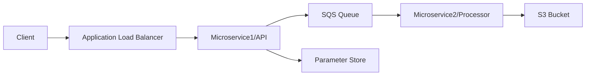

# Checkpoint Microservices Project


A distributed email processing system built with Python microservices and AWS infrastructure. The system provides a secure API for email data ingestion and reliable background processing for S3 storage.

## Table of Contents
- [Overview](#overview)
- [System Architecture](#system-architecture)
- [Project Structure](#project-structure)
- [API Documentation](#api-documentation)
- [Configuration](#configuration)
- [Setup and Installation](#setup-and-installation)
- [Message Processing Flow](#message-processing-flow)
- [Security](#security)
- [Monitoring and Troubleshooting](#monitoring-and-troubleshooting)
- [Development Guidelines](#development-guidelines)

## Overview

This project implements a scalable email processing system using microservices architecture:
- **Microservice1**: REST API service that receives and validates email requests
- **Microservice2**: Background processor that stores validated email data in S3
- **Infrastructure**: Managed through Terraform on AWS (eu-north-1)

## System Architecture

### Components


### AWS Services
- **ECS**: Container orchestration for both microservices
- **ALB**: Load balancer for API traffic distribution
- **SQS**: Message queue ("devops-queue") with 30s visibility timeout
- **S3**: Storage bucket ("devops-assn-bucket-eranzaksh")
- **SSM**: Parameter Store for token management
- **ECR**: Container registry for service images
- **VPC**: Network isolation with public/private subnets

### Infrastructure State
- Remote state in S3: "microservices-terraform-state-bucket"
- Terraform version requirement: >= 1.2

## Project Structure

```
.
├── microservice1/                 # Email Ingestion Service
│   ├── app.py                     # Flask API (Port 8000)
│   ├── Dockerfile                 # Container configuration
│   └── requirements.txt           # Dependencies: flask, boto3, python-dotenv
├── microservice2/                 # Email Processing Service
│   ├── app.py                     # SQS consumer (10 messages batch, 10s polling)
│   ├── Dockerfile                 # Container configuration
│   ├── entrypoint.sh             # Container startup script
│   └── requirements.txt           # Dependencies: boto3, python-dotenv
├── terraform/
│   ├── modules/
│   │   ├── ecs/                  # ECS cluster configuration
│   │   └── vpc/                  # Network configuration
│   ├── main.tf                   # Core infrastructure setup
│   ├── sqs_s3.tf                 # Queue and bucket configuration
│   └── [other .tf files]         # Additional infrastructure components
└── .github/                      # CI/CD configurations
```

## API Documentation

### Health Check
```http
GET /
```
Response: `"OK"` (200)

### Send Email
```http
POST /send-email
Content-Type: application/json

{
  "token": "your-auth-token",
  "data": {
    "email_timestream": "unix_timestamp",
    "other_email_data": "..."
  }
}
```

#### Validation
- Token must match SSM parameter store value
- Timestream must be valid Unix timestamp (1970-2100)

#### Success Response
```json
{
  "status": "Message sent to SQS"
}
```

## Configuration

### Environment Variables

| Variable | Description | Service |
|----------|-------------|----------|
| AWS_REGION | AWS region (eu-north-1) | Both |
| TOKEN_PARAM_NAME | SSM parameter for auth token | Microservice1 |
| SQS_QUEUE_URL | URL for devops-queue | Both |
| S3_BUCKET_NAME | devops-assn-bucket-eranzaksh | Microservice2 |

### Infrastructure Variables
Required variables in `terraform/variables.tf`:
- `aws_region`: AWS deployment region
- `public_subnet_cidrs`: CIDR blocks for public subnets
- `private_subnet_cidrs`: CIDR blocks for private subnets

## Setup and Installation

### Prerequisites
- AWS CLI configured for eu-north-1
- Terraform >= 1.2
- Python 3.x
- Docker

### Local Development
```bash
# Setup Microservice1
cd microservice1
python -m venv venv
source venv/bin/activate
pip install -r requirements.txt
python app.py  # Runs on port 8000

# Setup Microservice2
cd ../microservice2
python -m venv venv
source venv/bin/activate
pip install -r requirements.txt
python app.py
```

### Infrastructure Deployment
```bash
cd terraform
terraform init
terraform plan
terraform apply
```

## Message Processing Flow

1. Client sends authenticated POST request to /send-email
2. Microservice1:
   - Validates authentication token against SSM
   - Validates email timestamp
   - Sends valid messages to SQS queue
3. Microservice2:
   - Polls SQS queue (10 messages batch, 10s timeout)
   - Processes messages and stores in S3
   - Generates UUID-based filenames for storage
   - Deletes processed messages from queue

## Security

- **Authentication**: Token-based API authentication via SSM
- **Network Security**: 
  - VPC with public/private subnet isolation
  - Security groups for service access control
- **Message Security**:
  - SQS queue with 30s visibility timeout
  - Message deletion post-processing
- **Data Security**:
  - S3 bucket security policies
  - IAM roles with least privilege
- **Secret Management**:
  - SSM Parameter Store for sensitive data
  - Environment variable protection

## Monitoring and Troubleshooting

### Service Health
- API health endpoint: `GET /`
- Container health checks in ECS
- CloudWatch container logs

### Queue Monitoring
- SQS metrics in CloudWatch
- Queue depth monitoring
- Message age tracking
- Dead letter queue support

### Storage Monitoring
- S3 bucket metrics
- Object lifecycle management
- Storage class optimization

### Infrastructure
- Terraform state in S3
- AWS CloudWatch metrics
- VPC Flow Logs

## Development Guidelines

### Code Standards
- Follow PEP 8 for Python code
- Use consistent Terraform formatting
- Document all API endpoints
- Maintain test coverage

### Git Workflow
1. Create feature branch
2. Implement changes
3. Run tests locally
4. Submit pull request
5. Wait for CI/CD validation
6. Merge after approval

### Documentation
- Update README for significant changes
- Document new environment variables
- Maintain API documentation
- Update architecture diagrams

### Testing
- Unit tests for both services
- Integration tests for API
- Load testing for queue processing
- Infrastructure validation tests

---
For more information about the CI/CD process, see the `.github` directory.

